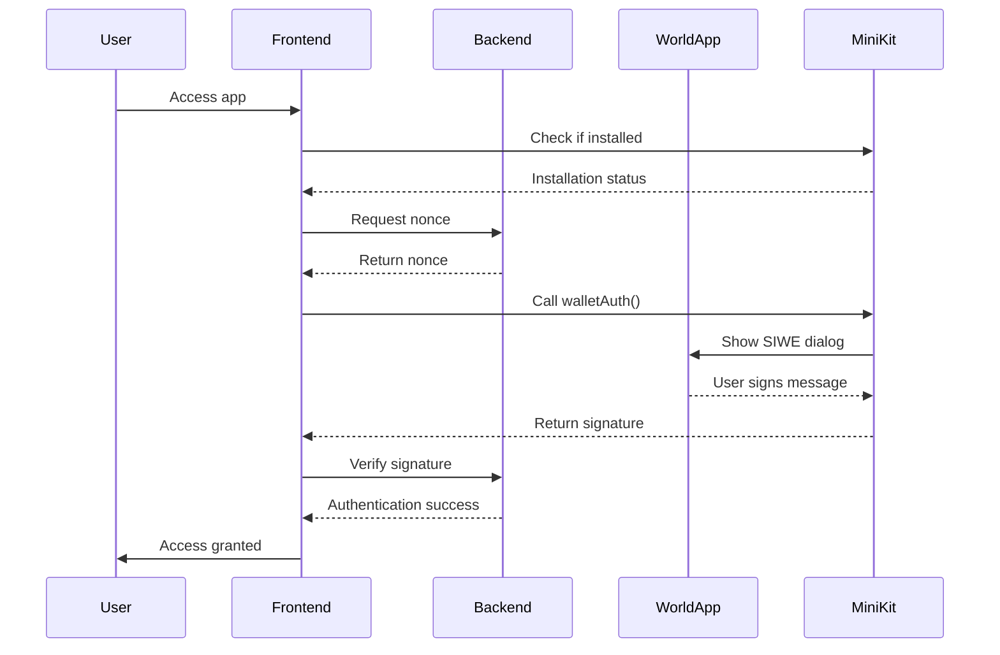

# 🔐 Wallet Authentication Guide

This guide explains how to use the **Sign in with Ethereum (SIWE)** feature implemented in the World Agent app using MiniKit.

## 🌟 Overview

The wallet authentication feature allows users to securely sign in to the World Agent app using their Ethereum wallet through the **World App**. This implementation follows the official MiniKit documentation and provides a seamless authentication experience.

## 🏗️ Architecture

### Frontend Components

1. **`MiniKitService`** - Core service for MiniKit integration
2. **`WalletAuth`** - Authentication UI component
3. **`AuthGuard`** - Route protection and authentication flow
4. **`App.tsx`** - Main application with authentication integration

### Backend Routes

1. **`GET /api/nonce`** - Generate authentication nonce
2. **`POST /api/complete-siwe`** - Verify and complete authentication
3. **`GET /api/auth-status/:address`** - Check authentication status

## 🚀 How It Works

### 1. Authentication Flow



### 2. Key Features

- **🔒 Secure Authentication**: Uses EIP-4361 (Sign-In with Ethereum) standard
- **🌍 World App Integration**: Seamless integration with World App
- **👤 User Info**: Access to username and wallet address
- **🛡️ Route Protection**: Automatic protection of authenticated routes
- **📱 Responsive Design**: Works on all device sizes
- **⚡ Real-time Status**: Live authentication status updates

## 🔧 Implementation Details

### Frontend Service (`MiniKitService`)

```typescript
// Check authentication status
const isAuthenticated = MiniKitService.isAuthenticated();

// Get user information
const walletAddress = MiniKitService.getWalletAddress();
const username = MiniKitService.getUsername();

// Sign in with wallet
const result = await MiniKitService.signInWithWallet();

// Sign out
MiniKitService.signOut();
```

### Backend API

#### Generate Nonce
```bash
GET /api/nonce
```
Returns:
```json
{
  "nonce": "abc123def456...",
  "timestamp": "2024-01-01T00:00:00.000Z"
}
```

#### Complete Authentication
```bash
POST /api/complete-siwe
```
Body:
```json
{
  "payload": {
    "status": "success",
    "message": "...",
    "signature": "0x...",
    "address": "0x..."
  },
  "nonce": "abc123def456...",
  "userInfo": {
    "username": "worlduser",
    "walletAddress": "0x..."
  }
}
```

Returns:
```json
{
  "status": "success",
  "isValid": true,
  "walletAddress": "0x...",
  "username": "worlduser",
  "timestamp": "2024-01-01T00:00:00.000Z"
}
```

## 🎨 UI Components

### AuthGuard Component
Protects routes and manages authentication state:

```tsx
<AuthGuard>
  <ProtectedComponent />
</AuthGuard>
```

### WalletAuth Component
Provides authentication interface:

```tsx
<WalletAuth
  onAuthSuccess={(result) => console.log('Authenticated!', result)}
  onAuthError={(error) => console.error('Auth failed:', error)}
/>
```

## 🔐 Security Features

### 1. Nonce Generation
- Uses `crypto.randomUUID()` for secure nonce generation
- Minimum 8 alphanumeric characters
- Server-side generation prevents tampering

### 2. Signature Verification
- ERC-191 compliant signatures
- Server-side validation
- Prevents replay attacks

### 3. Authentication State Management
- Secure state storage
- Automatic session cleanup
- Real-time status updates

## 🌐 World App Integration

### Requirements
- App must be opened in **World App**
- MiniKit must be installed and available
- User must have a World ID account

### User Experience
1. User opens app in World App
2. Authentication modal appears automatically
3. User clicks "Sign In with Ethereum"
4. World App shows SIWE dialog
5. User signs message to authenticate
6. App grants access to protected features

## 📱 Responsive Design

The authentication UI is fully responsive and works across:
- **Desktop**: Full-featured modal interface
- **Mobile**: Optimized touch interface
- **World App**: Native integration

## 🔧 Development Setup

### 1. Environment Variables
```bash
# Backend (.env)
MONGODB_URI=mongodb://localhost:27017/agent-web3
FRONTEND_URL=http://localhost:5173
PORT=3001

# Frontend (.env)
REACT_APP_API_URL=http://localhost:3001
```

### 2. Start Development Servers

Backend:
```bash
cd backend
npm install
npm start
```

Frontend:
```bash
cd agent-web3-mcp
npm install
npm start
```

### 3. Test in World App
1. Install World App on your device
2. Add your development URL to World App
3. Open the app and test authentication

## 🎯 Best Practices

### 1. Security
- Always validate nonces server-side
- Use HTTPS in production
- Store authentication state securely
- Implement proper session management

### 2. User Experience
- Provide clear feedback during authentication
- Handle errors gracefully
- Show loading states
- Maintain authentication state across sessions

### 3. Error Handling
- Network connectivity issues
- User rejection of authentication
- Invalid signatures
- Expired nonces

## 🔍 Troubleshooting

### Common Issues

1. **"MiniKit not installed"**
   - Solution: Open app in World App

2. **"Authentication failed"**
   - Check network connection
   - Verify backend is running
   - Check browser console for errors

3. **"Invalid nonce"**
   - Ensure nonce is generated server-side
   - Check nonce expiration

### Debug Mode

Enable debug logging:
```typescript
console.log('Auth state:', MiniKitService.getAuthState());
console.log('Is installed:', MiniKitService.isInstalled());
```

## 📚 Additional Resources

- [MiniKit Documentation](https://docs.worldcoin.org/minikit)
- [EIP-4361 (SIWE) Standard](https://eips.ethereum.org/EIPS/eip-4361)
- [World App Documentation](https://docs.worldcoin.org/world-app)

## 🤝 Contributing

When contributing to wallet authentication features:

1. Test thoroughly in World App
2. Follow security best practices
3. Update documentation
4. Add comprehensive error handling
5. Ensure responsive design

---

**Note**: This implementation is designed specifically for World App integration. For other environments, consider alternative authentication methods. 